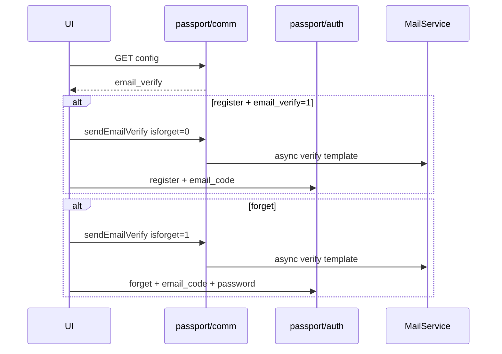

# Design: 用户端邮箱验证与找回密码

## Boundaries

| Layer | Change |
|-------|--------|
| API | `CommController#config` + `ConfigService.getEmailVerify()`；既有 `sendEmailVerify` / `register` / `forget` 不改契约 |
| UI | `siteBrand` / `site.ts`；`RegisterView`；新 `ForgetView`；`LoginView` 链；`router`；`auth.ts` API |

跨仓：`v2board-java-api` + `v2board-ui`。

## Contracts

### Public config

`GET /api/v1/passport/comm/config` data:

| Field | Type | Source |
|-------|------|--------|
| `app_name` | string | existing |
| `stop_register` | 0/1 | existing |
| `invite_force` | 0/1 | existing |
| `email_verify` | 0/1 | `safe.email_verify` via `intFromGroup` / dedicated getter |

### Send code

`POST /api/v1/passport/comm/sendEmailVerify`

```json
{ "email": "...", "isforget": 0 }
```

- Register: `isforget: 0`（邮箱已存在 → 失败）
- Forget: `isforget: 1`（邮箱不存在 → 失败）

### Register

```json
{ "email", "password", "invite_code?", "email_code?" }
```

`email_code` required only when server `email_verify=1`.

### Forget

```json
{ "email", "email_code", "password" }
```

## Data flow



## UI shape

- Register: when `emailVerify` true, show code row with send button + countdown; pass `email_code` in `register()`.
- ForgetView: mirror login/register chrome (`login.css`); fields email / code+send / password / password2.
- Login footer: `忘记密码？` → `/forget`；保留注册链接逻辑。

## Compatibility

- `email_verify=0`：注册行为不变。
- 公开配置仅增字段，旧前端忽略无害。
- WebConfig：passport 路径本就不在 JWT 拦截内。

## Trade-offs

| Topic | Choice | Why |
|-------|--------|-----|
| Forget vs email_verify | Forget always on | Backend always requires code |
| Sync mail | Keep async | Smaller scope; errors already surfaced if SMTP rejects sync path later |
| Code input | Always 6 digits UX | Aligns with `\\d{6}` server check |

## Rollback

Revert public `email_verify` + UI pages; admin toggle remains harmless if UI ignored.
