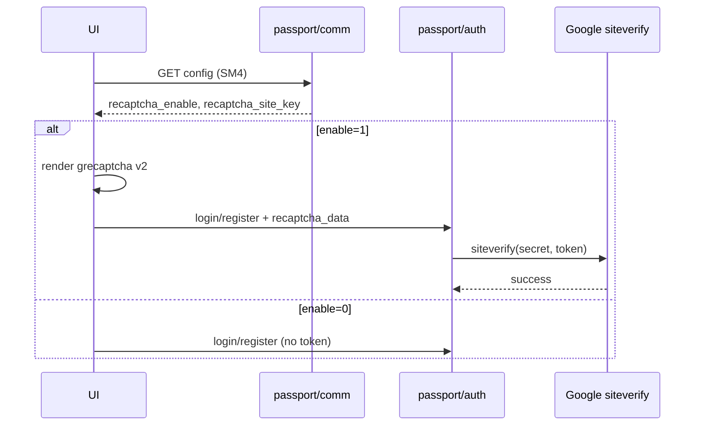

# Design: 用户登录/注册 reCAPTCHA v2

## Boundaries

| Layer | Change |
|-------|--------|
| API | Public config 增加 enable + site_key；`RecaptchaService` 调 Google siteverify；login/register 门禁 |
| UI | `siteBrand` 暴露开关与 site_key；Login/Register 挂 v2 widget；`auth.ts` 传 `recaptcha_data` |

跨仓：`v2board-java-api` + `v2board-ui`。

## Contracts

### Public config（SM4 plaintext 增量）

| Field | Type | Notes |
|-------|------|-------|
| `recaptcha_enable` | int 0/1 | `safe.recaptcha_enable` |
| `recaptcha_site_key` | string | `safe.recaptcha_site_key`；enable=0 时可为空串 |

**Never** include `recaptcha_key`.

### Login（保持 form-urlencoded）

```
POST /api/v1/passport/auth/login
email=&password=&recaptcha_data=   # recaptcha_data 仅 enable=1 时必填
```

### Register（JSON）

```json
{ "email", "password", "invite_code?", "email_code?", "recaptcha_data?" }
```

`recaptcha_data` required when server enable=1.

### Google verify

`POST https://www.google.com/recaptcha/api/siteverify`  
body: `secret` + `response` (+ optional `remoteip`)  
success=false → `BusinessException(500, "Invalid code is incorrect")`（对齐 PHP）。

开关开启但 Secret 未配置 → 500「reCAPTCHA 未正确配置」（避免静默放行）。

## Data flow



## Component sketch

- `ConfigService.getRecaptchaEnable()` / `getRecaptchaSiteKey()` / `getRecaptchaSecret()`（secret 仅服务端）
- `RecaptchaService.verify(token, remoteIp)` — RestTemplate/HttpClient，短超时
- `AuthController#login`：enable 时先 verify，再查用户
- `PassportService#register`：在 `checkEmailPolicy` 前后均可，建议尽早 verify
- UI：可选小组件 `RecaptchaV2.vue`（script 加载 + callback → token ref）；失败/过期需 reset

## Compatibility / Risks

- 登录多一个可选 query/form 字段，旧客户端在 enable=0 时不受影响；enable=1 时旧客户端会失败（预期）。
- 前端需可访问 `www.google.com` / `www.gstatic.com`（国内环境可能不可用——产品已知风险，不在本任务做镜像）。
- 单元测试 mock `RecaptchaService`，勿打真实 Google。

## Rollout / Rollback

- 默认 enable=0；运维填 key 后开启。
- 回滚：关开关或回退前后端提交；无 DB migration。
