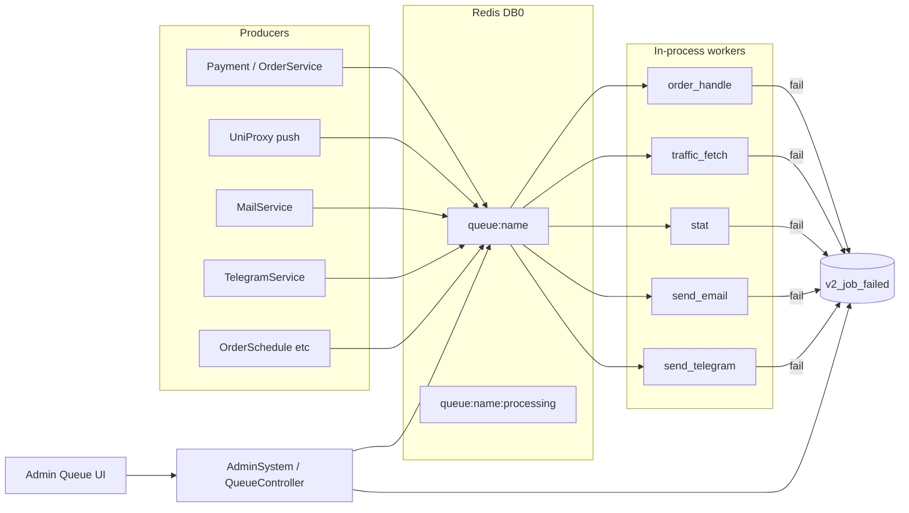

# Design — Redis job queues (C3)

## Architecture



## Queue names & handlers

| Queue | Job type | Handler (existing logic) | PHP UI label |
|-------|----------|--------------------------|--------------|
| `order_handle` | `OrderHandle` | `OrderService.handleOrder(tradeNo)` sync core | 订单队列 |
| `traffic_fetch` | `TrafficFetch` | Redis hash increment loop (today `trafficFetch`) | 流量消费队列 |
| `stat` | `StatUser` / `StatServer` | today `recordStatUser*` / `recordStatServer*` body | 统计队列 |
| `send_email` | `SendEmail` | `MailService` send internal | 邮件队列 |
| `send_telegram` | `SendTelegram` | Telegram Bot send | Telegram消息队列 |

Payload schema (JSON):

```json
{
  "id": "uuid",
  "type": "OrderHandle",
  "queue": "order_handle",
  "attempts": 0,
  "max_attempts": 3,
  "created_at": 1710000000,
  "data": { }
}
```

## Redis key layout

Prefix: existing `v2board.redis.prefix` if any, else `v2board:`.

| Key | Type | Meaning |
|-----|------|---------|
| `{prefix}queue:{name}` | LIST | waiting (LPUSH / BRPOP) |
| `{prefix}queue:{name}:processing` | LIST or ZSET | in-flight (member = payload, score = reclaim_at) |
| `{prefix}queue:meta:{name}:completed` | STRING/INCR | optional hour/window counters for UI |

**Claim**: `BRPOP` waiting → `ZADD` processing with reclaim timestamp.  
**Ack**: remove from processing.  
**Reclaim**: scheduled sweeper moves stale processing back to waiting (crash recovery).

## Failed jobs (MySQL)

New table `v2_job_failed` (Java-owned DDL under `src/main/resources/db/`):

| Column | Type |
|--------|------|
| id | BIGINT PK AI |
| uuid | VARCHAR(36) UNIQUE |
| queue | VARCHAR(64) |
| job_type | VARCHAR(64) |
| payload | MEDIUMTEXT |
| exception | TEXT |
| failed_at | BIGINT (unix) |

Entity + Mapper; no PHP ownership conflict (new table).

## Config

```yaml
v2board:
  queue:
    enabled: true
    reclaim-seconds: 300
    queues:
      order_handle: { concurrency: 2 }
      traffic_fetch: { concurrency: 2 }
      stat: { concurrency: 2 }
      send_email: { concurrency: 1 }
      send_telegram: { concurrency: 1 }
```

Hot-reload optional; MVP = restart to apply concurrency.

## Admin API (classicRel → catalog)

| Method | classicRel | Purpose |
|--------|------------|---------|
| GET | `system/getSystemStatus` | `schedule`, `queue_workers` (not fake horizon), uptime |
| GET | `system/getQueueStats` | failedJobs, recentJobs/jobsPerMinute approx, status |
| GET | `system/getQueueWorkload` | list: name, display_name, jobs, processes(concurrency), occupied/active |
| GET | `system/getFailedJobs` | paginated failed |
| POST | `system/retryFailedJob` | `{id}` → re-enqueue + delete failed row |
| POST | `system/deleteFailedJob` / clear | delete one or clear |

Align field names with UI; snake_case JSON.

## UI (`v2board-ui`)

- Route: `/{admin}/queue`（或 `system/queue`）
- Nav: 「队列监控」
- Sections: 总览 + 当前作业详情表 + 失败任务表（重试/删除）
- Labels map hardcoded to PHP Chinese names

## Migration / cutover

1. Ship broker + workers behind `v2board.queue.enabled` (default true in new code).
2. Switch producers to `JobQueue.dispatch` in same release; remove `@Async` from those methods (keep thread pools only if still needed elsewhere, else deprecate unused beans).
3. Keep schedules as safety net (they enqueue, not duplicate sync heavy work incorrectly — OrderSchedule enqueues handle).

## Rollback

- `v2board.queue.enabled=false` + restore `@Async` path via feature flag **or** hotfix revert.
- Prefer single-release cutover with flag for emergency sync fallback on order/email only if time permits; otherwise document revert commit.

## Compatibility notes

- Not Horizon: PHP admin talking to Java will see new endpoints, not Horizon masters.
- Redis DB0 shared with Java cache — use distinct key prefix `queue:`.
- Panel SM4/aliases: register new actions in catalog.
