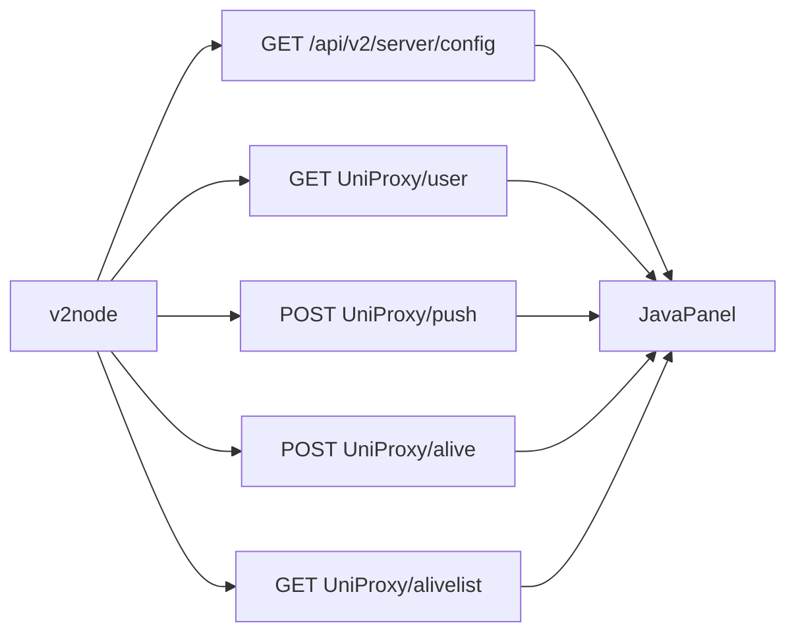

# Design — v2node ↔ Java 契约对齐

## Boundaries

| Layer | Role |
|-------|------|
| `v2node` (`/Users/jirehlam/Repos/v2node`) | 契约消费方；本轮只读对照，除非偏离 PHP |
| `V2ServerController` | v2node 拉配置唯一入口 `/api/v2/server/config` |
| `UniProxyController` | user / push / alive / alivelist（及非 v2node 的 UniProxy/config） |
| PHP wyx2685/v2board | 冲突时的权威形状 |
| `.trellis/spec/backend/server-node.md` | 稳定结论落点（增量，不重复矩阵全文） |

本轮**不**改 UI、安装脚本、xray 内核逻辑。

## Contract Surface

共同 query（v2node `panel.New`）：`token`、`node_id`、`node_type=v2node`。

### Endpoint contracts (expected consumer shape)

| Endpoint | Auth | Request | Response (v2node 关心) |
|----------|------|---------|------------------------|
| V2 config | token ≥16 匹配 | If-None-Match | 协议字段 + `base_config{push,pull,node_report_min_traffic,device_online_min_traffic}` + routes；304 |
| user | token + node | If-None-Match, msgpack 头 | `{users:[{id,uuid,speed_limit,device_limit,...}]}`；304 |
| push | token + node | JSON map uid→`[up,down]` | `{data:true}` |
| alive | token + node | JSON map uid→IP[] | `{data:true}`；面板按 `device_limit_mode` 计 alive |
| alivelist | 对照 PHP | — | `{alive: map[uid]count}` |

完整字段级矩阵写入任务目录 `contract-matrix.md`（实施第一步产出）。

## Data flow notes

- **阈值**：`node_report_min_traffic` / `device_online_min_traffic` 由节点侧过滤；面板不二次过滤 push。
- **ETag**：V2 config 与 user 均 SHA1 body；与 v2node `If-None-Match` / 304 行为对齐即可，不强求与 PHP 字节级一致。
- **msgpack**：user 在 `X-Response-Format` 含 msgpack 时返回 `application/x-msgpack`。
- **修复优先级**：矩阵漂移 → 查 PHP → 改 Java（默认）→ 补测试 → 必要时改 v2node → 可选更新 `server-node.md`。

## Compatibility / Rollback

- 仅扩展响应字段（如补 `speed_limit`）对旧节点应兼容。
- 收紧鉴权（若 PHP 要求 alivelist 带 token）可能影响未带 token 的客户端 — 变更前在矩阵注明风险；默认跟 PHP。
- 回滚：还原相关 Controller 与测试提交即可。

## Trade-offs

| Choice | Why |
|--------|-----|
| 矩阵落在 task 目录而非立刻全量进 spec | 审计过程中会变；稳定结论再进 `server-node.md` |
| 不跑真实节点 | 降低环境依赖；用客户端结构体 + 面板测试代替 |
| 测试聚焦现有 `*ControllerTest` | 与 `08-08-server-node-config` 一致，成本低 |

## Candidate drifts (verify in matrix)

1. `UniProxyController.user` 可能缺少 `speed_limit`（v2node `UserInfo` 需要；`User.speedLimit` 已存在）。
2. `alivelist` 是否免 token — 以 PHP 为准。
3. 其余协议字段：以 v2node `CommonNode` + `V2ServerController.buildV2nodeConfig` 对照，缺则补、多则无害。
